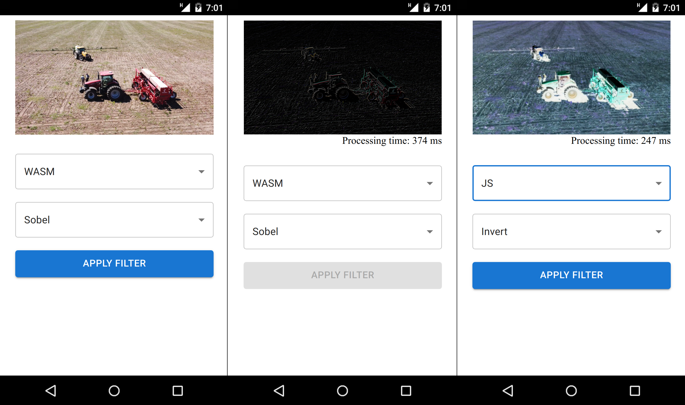

# Image processing app
This a simple hybrid app for Android that implements image filters (Sobel and Gaussian blur) in WebAssembly. The goal is to test the performance of computationally intensive algorithms implemented in JS and WASM.  
The web app is implemented using React and Material UI. The native platform APIs are provided by CapacitorJS. The WASM binaries are compiled with Emscripten.  



# Getting started

### Install and run web app live version
```bash
npm install
npm run dev
```

### Build optimized version for production
```bash
npm run build
```

### Build android project and open in AndroidStudio
AndroidStudio installed on your system is required
```bash
npx cap add android
npx cap sync
export CAPACITOR_ANDROID_STUDIO_PATH="...../android-studio/bin/studio.sh"
npx cap open android 
```


# Creating an hybrid (React+Capacitor) app with WASM scripts from scratch
For creating and configuring a new hybrid application the following steps are needed:

### Installing Vite
```bash
npm create vite@latest
cd APP_NAME
npm install
```

### Installing MUI (GUI styles)
```bash
npm install @mui/material @emotion/react @emotion/styled
```

### Installing Emscripten
Emscripten is portable, so, should be installed in another folder. 
```bash
cd .. # Exit the project folder
git clone https://github.com/emscripten-core/emsdk.git
cd emsdk
./emsdk install latest
./emsdk activate latest
source ./emsdk_env.sh
```

### Compiling c files and including wasm binaries to project
Assuming the .c files in the /wasm folder
```bash
mkdir -p public/wasm # Static files should be in public folder (see Vite doc)
cd wasm # Where the C project is
emcc main.c -O2 -sSTANDALONE_WASM -o main.wasm --no-entry
cp main.wasm ../public/wasm # Copy binary to public/wasm
cd .. # Back to root
```
After running these commands, wasm modules can be instantiated anywhere in the app using:
```js
let wasmInstance;
fetch('wasm/main.wasm').then(response => {
    response.arrayBuffer().then(bytes => {                   
        WebAssembly.instantiate(bytes, {})
        .then(module => {                    
            wasmInstance = module.instance.exports;
            // wasmInstance is ready.
        })
    });
});
```

### Installing CapacitorJS
```bash
npm install @capacitor/core @capacitor/cli
npx cap init # When running this, set 'dist' as source directory
npm install @capacitor/android
npx cap add android
```

### Run a live version of the web app
```bash
npm run dev
```

### Build project for production (web and mobile)
```bash
npm run build && npx cap sync
```
After running these commands, check if content of 'public' folder was included in the 'dist' directory.

### Open AndroidStudio project
Once the project is open, compiling, running and signing operations can be done from AndroidStudio
```bash
export CAPACITOR_ANDROID_STUDIO_PATH="...../android-studio/bin/studio.sh" 
npx cap open android 
```
